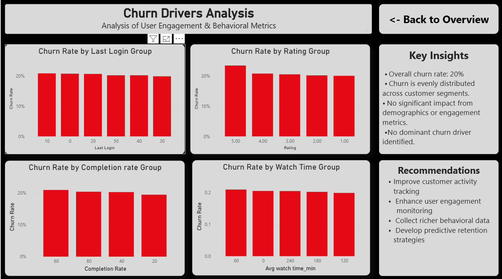

# Netflix Customer Retention Analysis

## Overview
This project analyzes customer retention and churn behavior using a Netflix user dataset. The dashboard helps identify churn trends across customer segments, demographics, subscription types, and engagement metrics.

## Tools Used
- Power BI
- Data Modeling
- DAX
- Data Visualization

## Key Metrics
- Total Users: 15K
- Retained Users: 12K
- Churn Users: 3K
- Churn Rate: 20%

## Analysis Performed
- Churn Rate by Country
- Churn Rate by Gender
- Churn Rate by Age Group
- Churn Rate by Subscription Type
- Churn Rate by Last Login Activity
- Churn Rate by Rating Group
- Churn Rate by Completion Rate
- Churn Rate by Watch Time Group

## Key Insights
- Overall churn rate remained around 20%.
- Churn was relatively consistent across countries and demographic groups.
- User engagement metrics showed limited variation in churn behavior.
- No single dominant churn driver was identified.

## Recommendations
- Improve customer activity tracking.
- Strengthen engagement monitoring.
- Collect richer behavioral data.
- Develop predictive retention strategies.

## Dashboard Preview

## Project Type
Portfolio project focused on customer retention analytics and churn analysis using Power BI.
